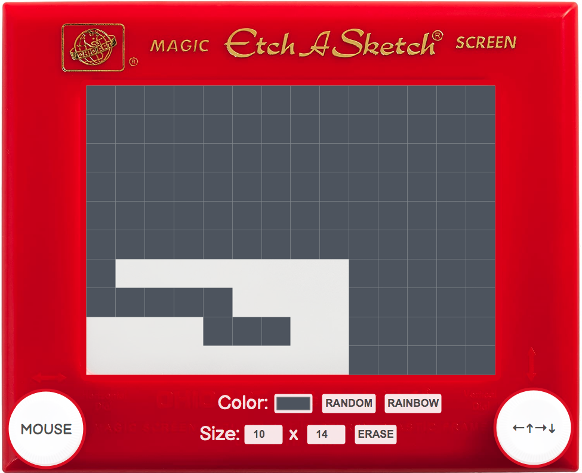

# Etch-a-Sketch

This project was part of The Odin Project JavaScript Curriculum.

# 

## Table of contents

1. [Demo](#demo)
2. [Technologies](#technologies)
3. [Features](#features)
4. [Development](#development)
5. [License](#license)

## Demo

Here is the working live demo:
[https://benjamin-gambling.github.io/etch-a-sketch/](https://benjamin-gambling.github.io/etch-a-sketch/).

## Technologies

- Vanilla JS, ES6+

## Features

- Designed like original item
- Mouse + Keyboard options
- Color Picker
- Random + Rainbow Color
- Adjust Size
- CLear

### Development

- Load image

## License

> You can check out the full license [here](LICENSE)

This project is licensed under the terms of the **MIT** license.
